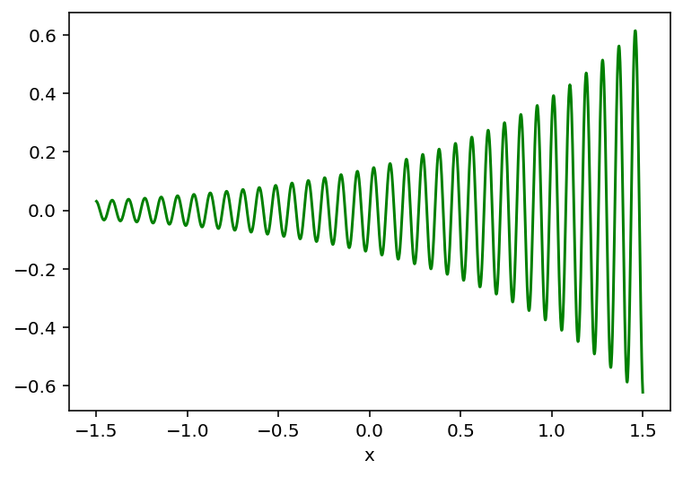
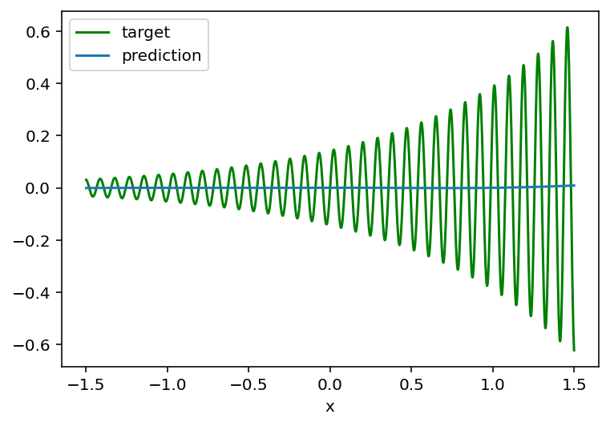
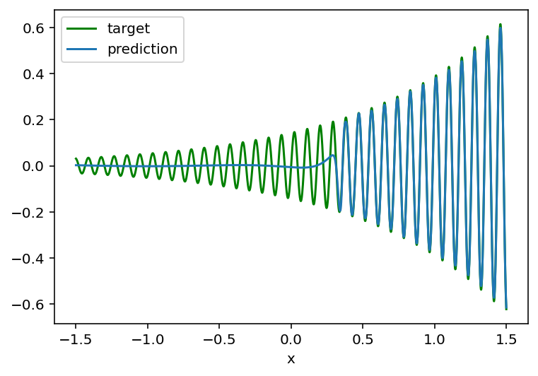
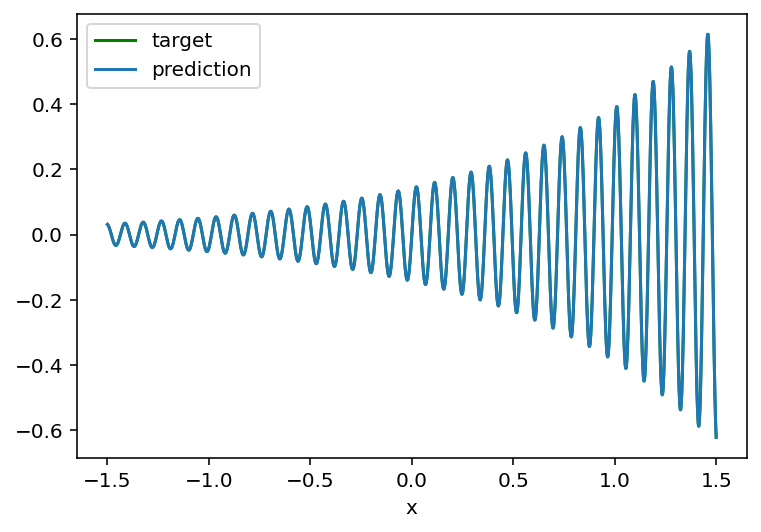

# Universal Approximation Theorem Demo

This repository contains step-by-step PyTorch experiments showing how a neural network approximates a difficult nonlinear function.

We start from a harder target:

y = sin(70x) · exp(x) / 7

and then improve the model step by step.

## Goal

The goal of this project is to understand what happens when a standard MLP tries to fit a high-frequency function, and how to fix the problem.

## Step-by-step experiments

The `code/` folder contains 7 scripts:

1. `01_generate_harder_function.py`  
   Generate and visualize the harder target function.

2. `02_old_model_on_new_function.py`  
   Test the old shallow model on the new function.

3. `03_adam_optimizer.py`  
   Replace SGD with Adam.

4. `04_wider_model.py`  
   Increase model width.

5. `05_deeper_model.py`  
   Increase model depth.

6. `06_normalized_input.py`  
   Normalize the input.

7. `07_fourier_features.py`  
   Add sinusoidal input features. This is the final successful solution.

## Main observations

- The old shallow model fails on the harder function.
- Changing the optimizer alone is not enough.
- Increasing width alone is not enough.
- A deeper model helps a lot.
- Better input representation is the key improvement.
- Adding sinusoidal features allows the model to fit the function very accurately.

## Example results

### Harder target function


### Old model fails


### Deeper model helps


### Final result with Fourier features


## Project structure

```text
code/
images/
README.md
requirements.txt
.gitignore
